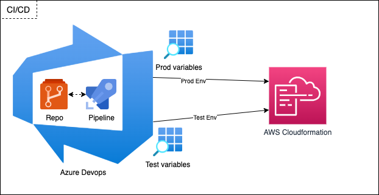

# AWS SAM Marketing Cloud Custom Activity

This project contains source code and supporting files for a serverless application that you can deploy with the SAM CLI. It could also be deployed directly via a CI/CD using Github Actions or Azure Pipelines.

It includes the following ressources and folders.

- .github - Workflow for building the application using Github Action.
- dependencies - Code for the application's AWS Layers. Node Modules must be imported.
- events - Invocation events that you can use to invoke the functions.
- images - Image for the repository Readme.
- lambda - Folder for the application's Lambda functions.
- lambda/CallSmsApi - Function triggered by the SQS Queue and used to call the SMS Api.
- lambda/CallSmsBulkApi - Function triggered by the SQS Bulk Queue and used to call the SMS Bulk Api.
- lambda/ExecuteEntry - Function triggered by the API Gateway and used to send message the SQS Queue.
- lambda/PublisheEntry - Function used by Maketing Cloud when validating the journey.
- lambda/{{function}}/tests - Unit tests for the application code.
- public - Folder containing the custom activity UI code.
- template.yaml - A template that defines the application's AWS resources.
- azure-pipelines.yaml - Workflow for building the application using Azure Pipelines.

The application uses several AWS resources, including Lambda functions, SQS Queue and an API Gateway API. These resources are defined in the `template.yaml` file in this project. You can update the template to add AWS resources through the same deployment process that updates your application code.

## Application resources:

See the following diagram of the application AWS infrastructure  :


It includes the following ressources and folders.

- 1: Marketing Cloud will access the config.json and UI from the public S3 buckets.
- 2: Marketing Cloud will call the save/publish/validates routes when activating the journey.
- 3: Api Gateway will call the PublishFunction returning a 200 status code.
- 4: Marketing Cloud will call the execute route during journey execution and pass data using Data Binding (https://developer.salesforce.com/docs/atlas.en-us.noversion.mc-apis.meta/mc-apis/how-data-binding-works.htm)
- 5: Api Gateway will call the ExecuteFunction. The function send the data into the SQS Queue and return a 200 status code.
- 6: SQS Queue will receive all the messages and trigger the CallSMSApiFunction/CallSMSBulkApiFunction. It will retry only once and send the message records to the SQS DeadQueue.
- 7: The CallSMSApiFunction/CallSMSBulkApiFunction parse the records from the SQS Queue and make an api call to the SMS Api endpoint. The message are deleted from the queue only if the function return a 200 status code. 
**Current batch size is 1, when implementing the bulk api it is essential to delete the message manually using the sqs.deleteMessage method.**

## Application and Resources settings

The default application settings are configured to fit a maximum concurrency of 150 and single API call.

SQS Queues settings:
- SQS Bulk Queue:
  - Visibility timeout 60 seconds
  - Delivery delay 0
  - retention 4 days
  - max size message 256kb
  - Receive message wait time 20 seconds
  - dead queue + Maximum receives 2
- SQS Queue:
  - Visibility timeout 60 seconds
  - Delivery delay 0
  - retention 4 days
  - max size message 256kb
  - Receive message wait time 20 seconds
  - dead queue + Maximum receives 2
- SQS Dead pool:
  - Visibility timeout 30 seconds
  - Delivery delay 0
  - retention 4 days
  - max size message 256kb
  - Receive message wait time 20 seconds

Lambda Function settings:
- CallSmsBulkApiFunction:
  - Retry number: 1
  - Retry timeout: 1 minute
  - Timeout: 15 seconds
  - memory: 128mb
  - concurrency reserved: 150
  - SQS Queue Trigger:
    - Batch size: 50
    - Batch window: 10 seconds
- callSmsApiFunction:
  - Retry number: 1
  - Retry timeout: 1 minute
  - Timeout: 15 seconds
  - memory: 128mb
  - concurrency reserved: 150
  - SQS Queue Trigger:
    - Batch size: 1
    - Batch window: 30 seconds
- executeFunction:
  - Retry number: 2
  - Retry timeout: 1 minute
  - Timeout: 5 seconds
  - memory: 128mb
- publishFunction:
  - Retry number: 2
  - Retry timeout: 1 minute
  - Timeout: 5 seconds
  - memory: 128mb

API Gateway settings:
- HttpAPI:
  - burst limit: 100
  - rate limit: 1000
  - timeout: 20 seconds

## Deploy the application

The application will be built and deployed directly from Azure Pipelines or Github Actions.

Github Actions:

If using Github action, you will need to create the variables under Settings and Secrets:


Azure Pipelines:



If using Azure Pipelines, you will need to clone the repository, create the Pipelines and set up 2 variable groups in Library:
* **mc-custom-activity-prod-env-variable-group**: containing your production variables
* **mc-custom-activity-uat-env-variable-group**:
containing your testing variables

The first group will contain the production variables and used when a commit is pushed to the `main branch`.
The second will contain the test data when a change is made on the `test branch`.

For both groups you must create the following variable:
* **AWS_STACK_NAME**: The name of the stack to deploy to CloudFormation. This should be unique to your account and region, and a good starting point would be something matching your project name.
* **AWS_REGION**: The AWS region you want to deploy your app to.
* **AWS_SERVICE_CONNECTION_NAME**: The name of the Azure Service Connection to AWS.
* **AWS_BUCKET_NAME**: The name of the bucket to deploy to CloudFormation template.
* **AWS_BUCKET_NAME_PUBLIC**: The name of the bucket to deploy the public folder contianing the Custom Activity UI. This folder must possess the public read permission.
* **ENDPOINT_URL_SMS**: The endpoint of the SMS Gateway.
* **MC_JWT_SECRET**: The Marketing Cloud JWT secret that you can retrieve from Installed Packages. It is used to decrypt the payload.
* **SMS_GATEWAY_KEY**: The SMS Gateway secret used to make SMS api called.
* **SMS_API_CONCURRENCY**: The maximum concurrency used to send request to the SMS Gateway.


## Test the application locally

To build and deploy your application for the first time, run the following in your shell:

```bash
test-mc-api$ sam build
test-mc-api$ npm run debug:api
test-mc-api$ curl http://localhost:3000/
```

The first command will build the source of your application. The second command will emulate your application's API and run the API locally on port 3000.

The SAM CLI installs dependencies defined in `package.json`, creates a deployment package, and saves it in the `.aws-sam/build` folder.

Test a single function by invoking it directly with a test event. An event is a JSON document that represents the input that the function receives from the event source. Test events are included in the `events` folder in this project.

Run functions locally and invoke them with the `sam local invoke` command.

```bash
test-mc-api$ npm run lambdaExecute
test-mc-api$ npm run lambdaPublish
test-mc-api$ npm run lambdaApi
```

The SAM CLI reads the application template to determine the API's routes and the functions that they invoke. The `Events` property on each function's definition includes the route and method for each path.

```yaml
      Events:
        PublishEntry:
          Type: HttpApi
          Properties:
            ApiId: !Ref HttpSmsMcApi
            Path: /publish
            Method: POST
            TimeoutInMillis: 10000
```

## Unit tests

Tests are defined in the `{{function}}/tests` folder in the Lambda folder. Use NPM to install the [Mocha test framework](https://mochajs.org/) and run unit tests. You can run the test for each lambda function or make a general test using:

```bash
test-mc-api$ npm install
test-mc-api$ npm run testSaved
```

## Cleanup

To delete the sample application that you created, use the AWS CLI. Assuming you used your project name for the stack name, you can run the following:

```bash
test-mc-api$ delete-stack --stack-name {{AWS_STACK_NAME}}
```

## Installed on Marking Cloud

Please first replace the {{API_ENDPOINT}} in the config.js file with the API Gateway HttpApi endpoint.

You will need to retrieve the url from your public bucket containg the public folder files. You can also use a private access buckets by adding a Bucket policy and making sure Marketing Cloud IP ranges are whitelisted (https://help.salesforce.com/s/articleView?id=sf.mc_es_ip_addresses_for_inclusion.htm&type=5):

```
{
    "Version": "2012-10-17",
    "Id": "S3PolicyIPRestrict",
    "Statement": [
        {
            "Sid": "IPAllow",
            "Effect": "Allow",
            "Principal": "*",
            "Action": "s3:*",
            "Resource": "arn:aws:s3:::testsiteantoine/*",
            "Condition": {
                "IpAddress": {
                    "aws:SourceIp": [
                        "11.11.11.11/32",
                        "22.22.22.22/32"
                    ]
                }
            }
        }
    ]
}
```

To install the Custom Activity, please go to Setup, Install Packages and create or edit a new Package.
Click `add a component` and select `Journey Builder Activity`. Enter a name, description, category and the  url from your public bucket where the files of the public folder are hosted.


## Setup on Journey Builder

In Journey Builder you will need to drag and drop the activity in the journey and click to setup the settings.

Please make sure that your entry data extension is sendable and has the required fiels:
- mobileNumber: contact mobile number in the format (countryCode) + Number without the +
- mobileCountryCode: three-letter country codes
- smartCountryCode: four-letter country codes for Smart SMS only
- id (optional): unique identifier used for retrieving the data from Denodo. If not provided it will be passed by default as "journeyName_ActivityName_ContactKey_SentDateEpochTime"
- attributeData (optional): any additional fields require for personnalization

To add any attributeData from the Data Extension into the content or characteristc (value) fields, please use the format {{AttributName}}. It will be automatically replaced in the payload during the Execute request. 

**Standard SMS:**

Enter your SMS Content, Priority, IsSensitive and Sender Name information:


**Smart SMS:**

A few additional parameters are available:
- Template
- Characteristic: values must be the data extension fields name
- SearchIndexes


**Prewiew:**

You could notice that Characteristic values have been automatically replaced with the correct Data Binding format


Please click done and activiate your journey. You should receive the SMS after a few minutes.

## Debug and FAQ:

If you have not receive the SMS, please check your data extension information and ask the team to have a look at the Dead Queue.
If no information are available you will need to debug using AWS logs.